# URL Shortener

This is a URL Shortener application that allows you to generate shortened URLs for long URLs. It consists of a front-end
and a back-end, built using the following technologies:

## Front-end

- Vue 3
- Pinia (state management)
- Tailwind CSS
- Axios (HTTP requests)

## Back-end

- Java 11
- Vert.x (Web framework)
- jOOQ (database query library)
- Elasticsearch (search engine)
- Logstash (collects data from the back-end and sends it to Elasticsearch)
- MariaDB (database)
- Kafka (message broker)

## Architecture


##### Front-end

- **web-services**: url-shortener UI.

##### Back-end

- **gateway**:
    - API gateway for the web-services.
    - Is only one exposed to the outside world.
    - Handles JWT authentication.
- **auth-service**:
    - Handle authentication and authorization.
- **user-service**:
    - Handle user APIs.
- **shortener-service**:
    - Handle URL APIs.
    - Sends a message to Kafka when a URL is clicked.
- **statistic-service**:
    - Handle statistic APIs.
    - Receives a message from Kafka when a URL is clicked.
    - Collect statistic data from elasticsearch.

##### Database

- **shortenUser**:
    - Stores user information.
- **shortenUrl**:
    - Stores URL information.
- **shortenStatistic**:
    - Stores URL statistic information.

##### Others

- **elasticsearch**: search engine.
- **logstash**: collects data from shortenStatistic and sends it to elasticsearch.
- **kafka**: message broker.

## Installation

**1. Clone the repository:**

```
git clone https://github.com/hieplp/url-shorten.git
```

**2. Front-end setup:**

```
  cd url-shortener/web-services
  npm install
  npm run dev
```

**3. Back-end setup:**

```
  cd docker
```

**3.1. Build jar file**

3.1.1. Build all services

```
  sh build.sh
```

3.1.2. Build a service

```
  cd <service_name>
  sh build.sh 
```

**3.2. Setup Docker**

- Set up Docker environment variables in .env file.
- Only need to set up the first time.

```
  docker-compose up -d setup
```

**3.3. Build Docker**

3.3.1. First time or when the code changes

- Build Docker images for all services (Only need to build when the code changes)

```
  docker-compose up -d --build
```

3.3.2. Next times

```
  docker-compose up -d
```

## License

The project is licensed under the MIT License.

## Screenshots

**1. Register**
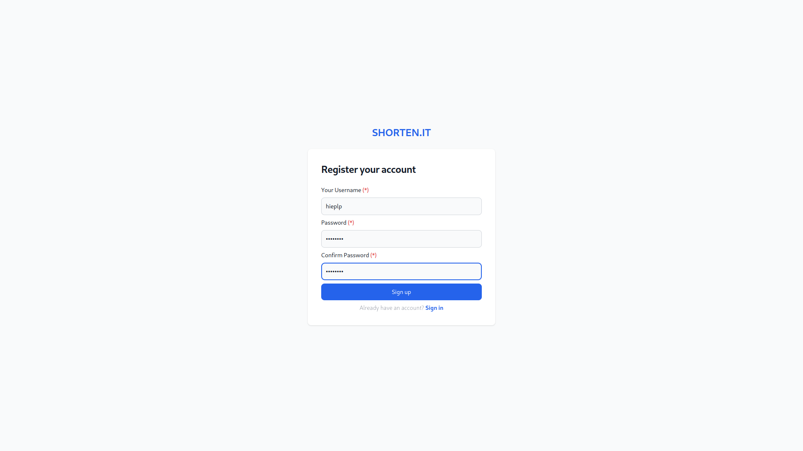

**2. Login**
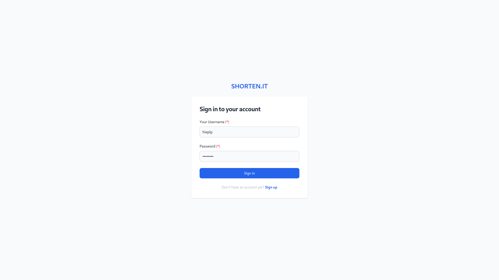

**3. Profile**
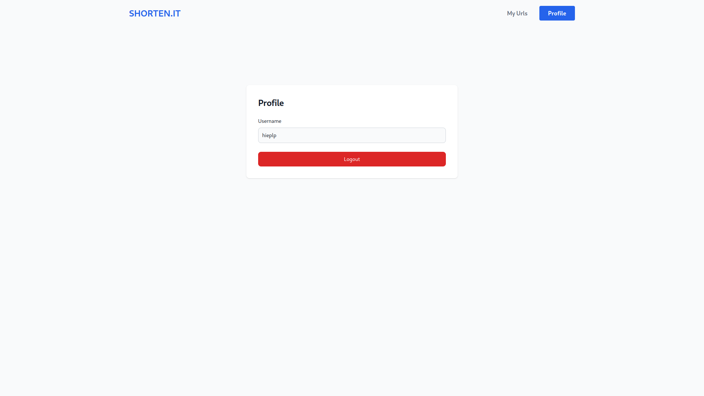

**4. Shorten URL**

4.1. Authenticated
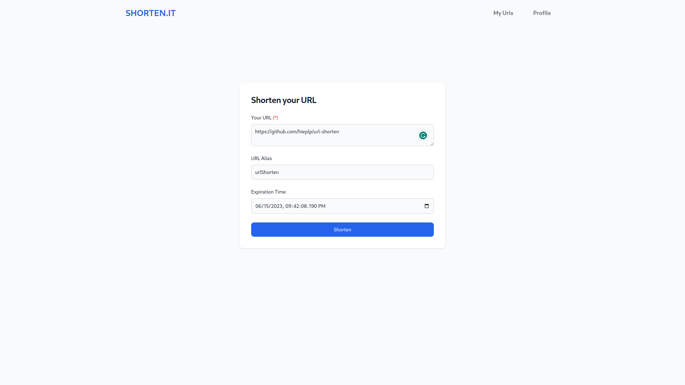
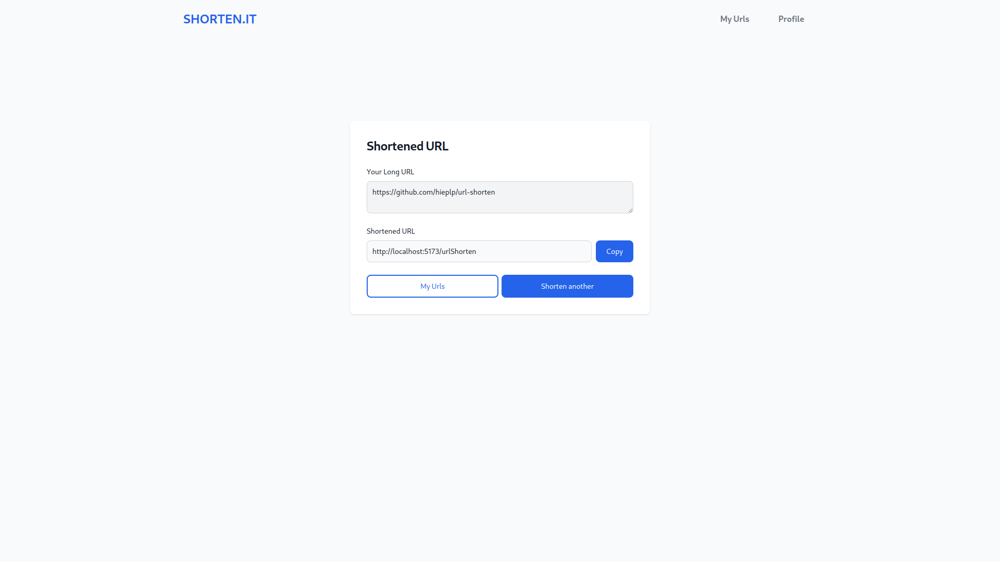

4.2. Unauthenticated
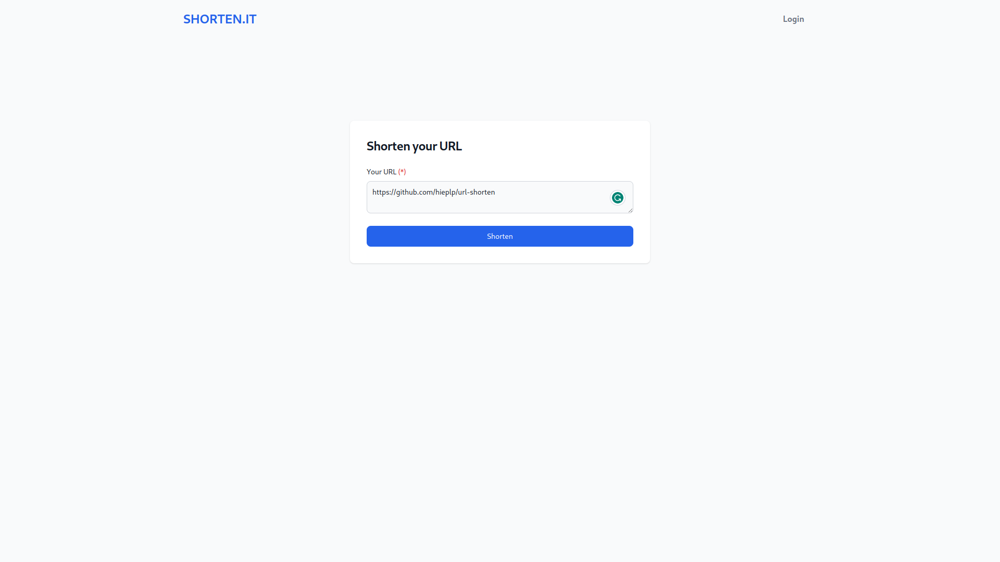
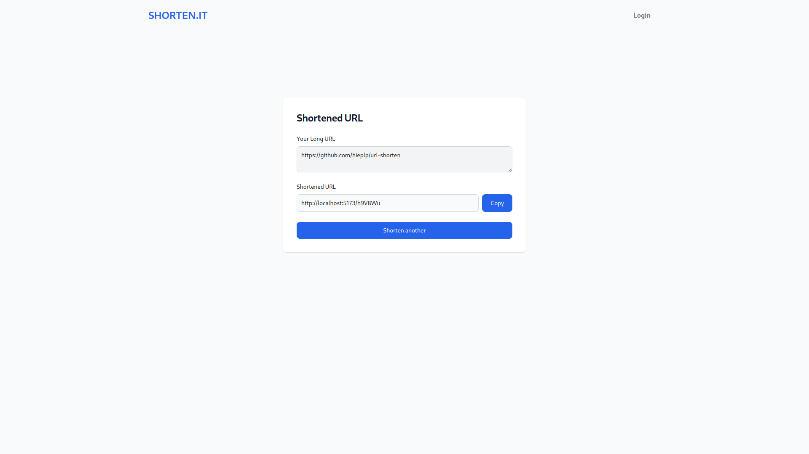

**5. URL List**
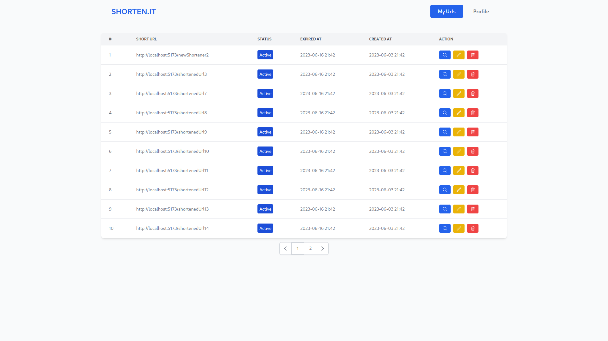

**6. Update URL**
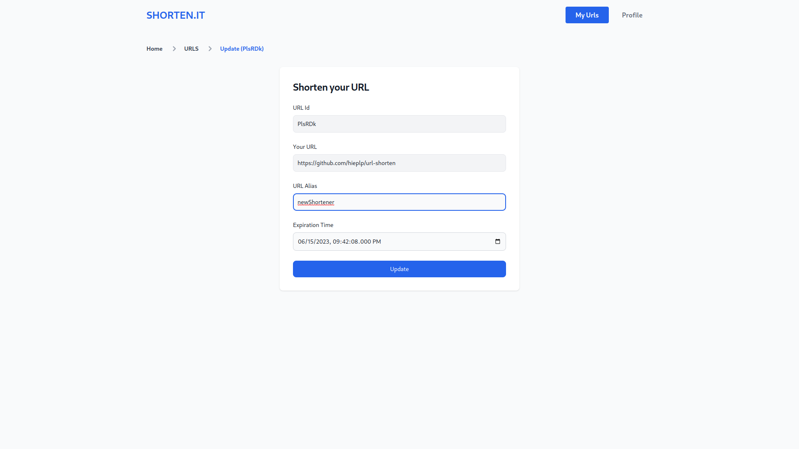

**7. Delete URL**
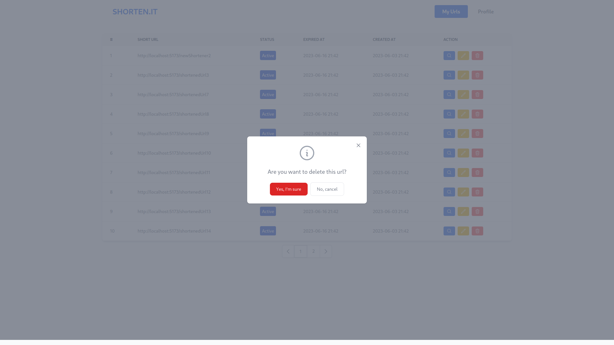

**8. URL Detail**
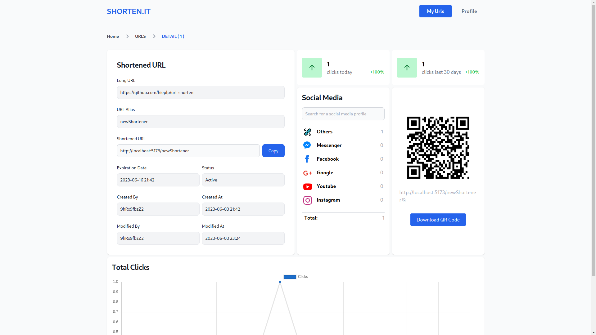
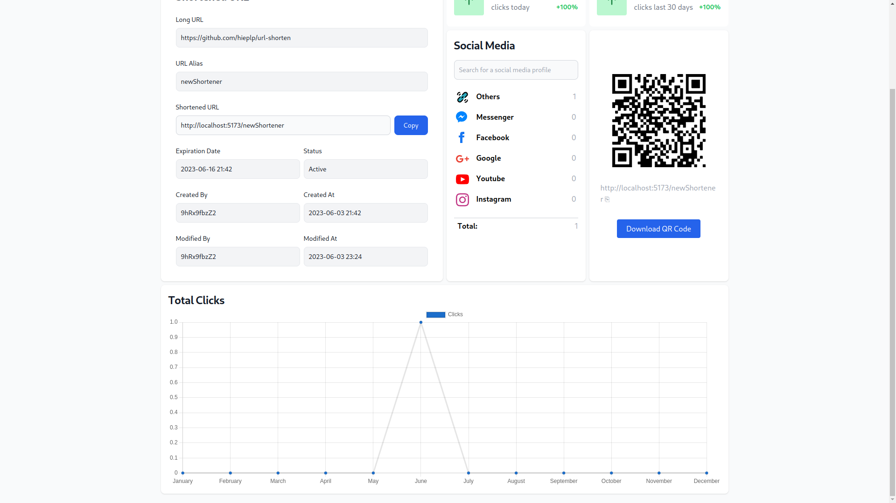

## References

[Elastic stack (ELK) on Docker](https://github.com/deviantony/docker-elk)
